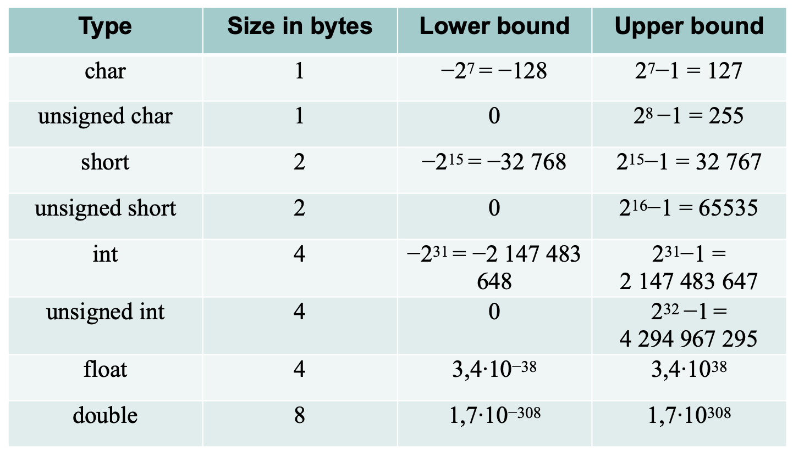

<head>
  
  
</head>

# Computer Science

## Types of declare

 

 ## Syntaxs

 ### printf

> %d：输出整数。%f：输出浮点数。%c：输出字符。%s：输出字符串。

    #include <stdio.h>
    int main() {
        int age = 25;
        float height = 175.5;
        char grade = 'A';
        char name[] = "Alice";
        
        printf("Name: %s\n", name);       // 输出字符串
        printf("Age: %d\n", age);         // 输出整数
        printf("Height: %.1f\n", height); // 输出浮点数，保留1位小数
        printf("Grade: %c\n", grade);     // 输出字符
        
        return 0;
    }
    Name: Alice
    Age: 25
    Height: 175.5
    Grade: A

### scanf

    scanf("格式字符串", &变量1, &变量2, ...);
> 格式字符串：定义要读取的数据类型。
变量：存储用户输入的值，需要传入变量的地址（用 & 取地址符号）。

    #include <stdio.h>

    int main() {
        int age;
        float height;
        char grade;
        char name[50];  // 预留50个字符空间存储输入的字符串
        
        printf("Enter your name: ");
        scanf("%s", name);  // 输入字符串
        
        printf("Enter your age: ");
        scanf("%d", &age);  // 输入整数时要使用 & 符号
        
        printf("Enter your height (in cm): ");
        scanf("%f", &height);  // 输入浮点数
        
        printf("Enter your grade: ");
        scanf(" %c", &grade);  // 输入字符时也要使用 & 符号，前面有空格防止读取换行符
        
        // 输出刚才输入的值
        printf("\nName: %s\n", name);
        printf("Age: %d\n", age);
        printf("Height: %.1f cm\n", height);
        printf("Grade: %c\n", grade);
        
        return 0;
    }

### Decrement and Increment

> a++和++a的区别

- **a++**

**含义:** 先使用当前值，然后再增加 1。

**操作顺序：**

1. 返回 a 当前的值。

2. a 的值加 1。

- **++a**

**含义：** 先增加 1，然后再使用增加后的值。

**操作顺序：**

1. a 的值加 1。

2. 返回增加后的值。

    #include <stdio.h>

    int main() {
        int a = 5;
        
        // 后置自增
        int b = a++;  // b = 5, a 变成 6
        printf("After a++: a = %d, b = %d\n", a, b);
        
        a = 5;  // 重置 a 的值为 5

        // 前置自增
        int c = ++a;  // a 先变成 6, 然后 c = 6
        printf("After ++a: a = %d, c = %d\n", a, c);
        
        return 0;
        }
        After a++: a = 6, b = 5
        After ++a: a = 6, c = 6

### If else 

    if (condition) {
        // 当 condition 为真时执行的代码
    } else {
        // 当 condition 为假时执行的代码
    }

### Loops

1. **while**

        while(condition){
            body of the Loops
        }

2. **do while**

        do{
            body of loop
        }
        while(condition)

3. **for**

        for(initialization;conditon;update){
            body of loops
        }

### define a function

    返回类型 函数名(参数类型1, 参数类型2, ...) {
        // 函数体
    }

> 没有返回值的函数可以用void来定义。

### Array

1. 数组的传递

        void printArray(int arr[], int size) {
            for(int i = 0; i < size; i++) {
                printf("%d ", arr[i]);
            }
            printf("\n");
        }

        int main() {
            int numbers[5] = {1, 2, 3, 4, 5};
            printArray(numbers, 5);
            return 0;
        }

2. 指针在数组中的作用

        int arr[5] = {10, 20, 30, 40, 50};
        int *p = arr;  // 指向数组的第一个元素
        printf("%d\n", *p);    // 输出 10
        printf("%d\n", *(p + 1));  // 输出 20

### pointer

1. malloc与free

        #include <stdio.h>
        #include <stdlib.h>

        int main() {
            int n;
            printf("请输入数组的大小: ");
            scanf("%d", &n);

            // 动态分配 n 个整数大小的数组
            int *arr = (int *)malloc(n * sizeof(int));  // 分配 n 个 int 类型的内存

            if (arr == NULL) {
                // 检查内存分配是否成功
                printf("内存分配失败\n");
                return 1;
            }

            // 初始化并打印数组元素
            for (int i = 0; i < n; i++) {
                arr[i] = i + 1;  // 初始化数组元素
                printf("arr[%d] = %d\n", i, arr[i]);
            }

            free(arr);  // 释放数组内存
            return 0;
        }

### Sort

1. bubble sort
2. insertion sort
3. selection sort