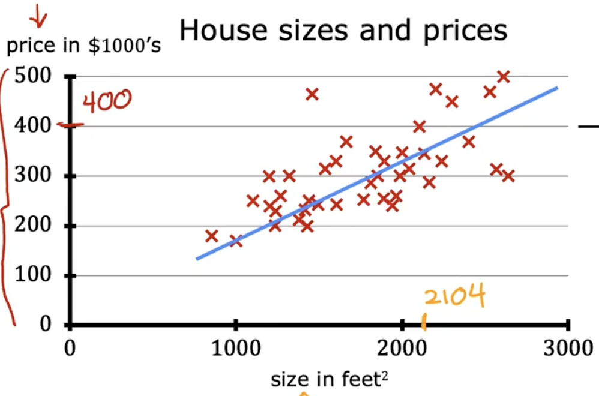
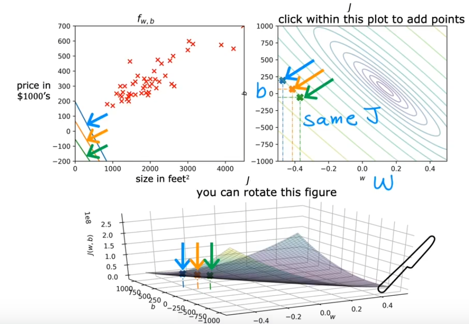
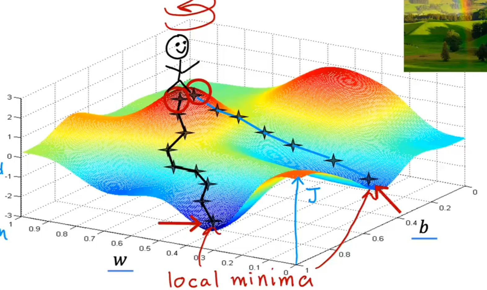
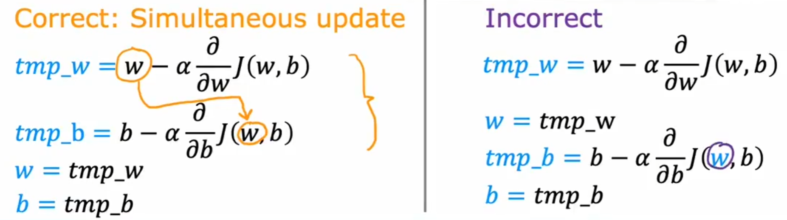
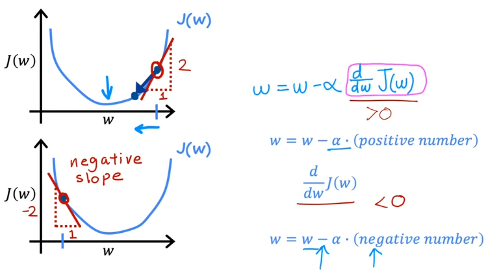
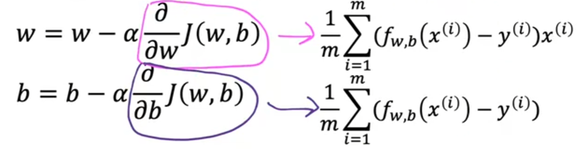
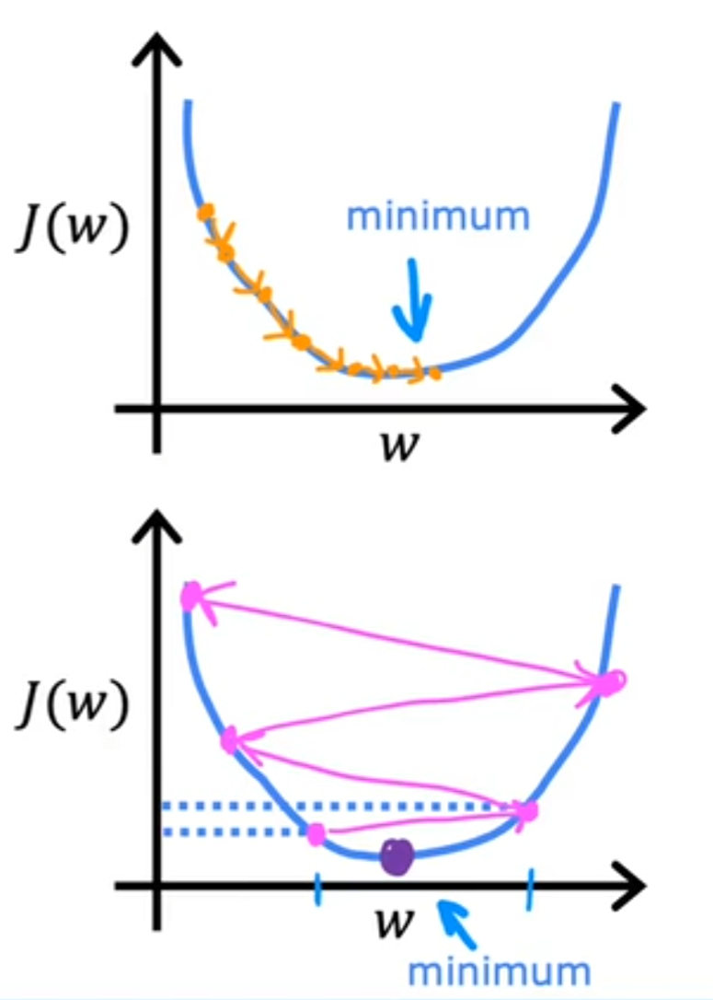
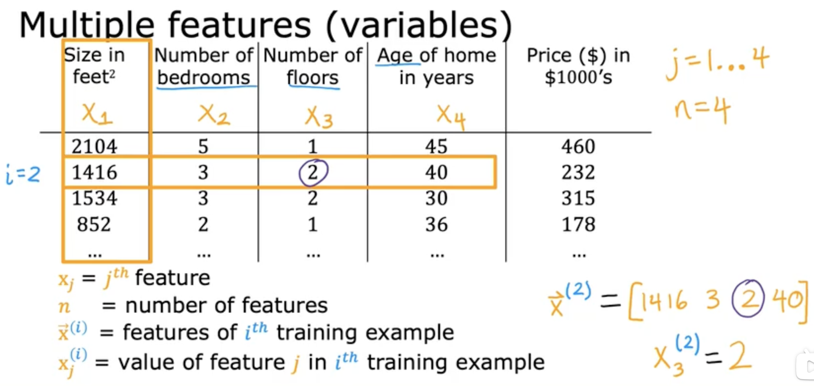

<head>
  
  
</head>

- [What is Machine Learning?](#what-is-machine-learning)
- [Supervised learning 监督学习](#supervised-learning-监督学习)
  - [Linear regression model 线性回归模型](#linear-regression-model-线性回归模型)
  - [Cost function 代价函数](#cost-function-代价函数)
  - [Gradient descent 梯度下降](#gradient-descent-梯度下降)
    - [Learning rate choise](#learning-rate-choise)
    - [Kinds of gradient descent](#kinds-of-gradient-descent)
  - [Multiple linear regression](#multiple-linear-regression)

## What is Machine Learning?

The machine learning has two kinds of algorithms. One is **supervised learning**, one is **unsupervised  learning**.

- **supervised learning**
  1. Make regression:It has an input x then give an output y(the right answers also called data sets).
  2. Make classification: predict categories, like give a diagnos of breast cancer(benign or malignant).

- **unsupervised learning**
  Data only comes with inputs x, but not outputs y. The algorithm has to find the some structure through the data. 

## Supervised learning 监督学习

### Linear regression model 线性回归模型

 

 Definitions:
 1. training set: the data we give to train the model
 2. x: inpute variable
 3. y: output variable
 4. m: number of training examples
 5. f(model): the function 
 6. $\widehat{y}$ :the predicted value
 7. linear regressing with one variable[univariate linear regression]: like the line in the picture

### Cost function 代价函数

Definitions:
1. error: equals to $\widehat{y}^i-y^i$
2. cost function: It is used to show how closely the function $f$ fits the real value. It equals to 
   
   $$J=\frac{1}{2m}\sum_{i=1}^m(\widehat{y}^i-y^i)^2$$

We can use contour plots to see the J curve directly like the picture below.

 

### Gradient descent 梯度下降

 

 This picture shows how gradient descent works to find the local minima. That is:
 1. choose a starting point
 2. look around to see the steep way to take the fasted step
 3. repeat the steps above

**The gradient descent algorithm**

We have to repeat these two algorithms until convergence.

$$w=w-\alpha\frac{\partial}{\partial w}J(w,b)$$

$$b=b-\alpha\frac{\partial}{\partial b}J(w,b)$$

 

Here $\alpha$ is **learning rate**. It's a value between 0 and 1. It controls how big step we will make each time.

About the partial derivative part. This is how it works if we assume b=0 and there is just one parameter w.

 

  

#### Learning rate choise

If $\alpha$ is too small, the gradient descent will be very slow. But if $\alpha$ is too big, it will never get to the minimum and it's fail to converge.

 

#### Kinds of gradient descent

1. Batch gradient descent 批量梯度下降 :
   Each step of gradient descent uses all the training samples.

### Multiple linear regression

 

$$f_{\bar{w},b}(\bar{x})=\bar{w}\cdot \bar{x}+b =w_1x_1+w_2x_2+\cdots+b$$