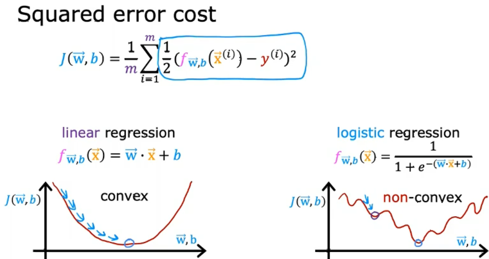
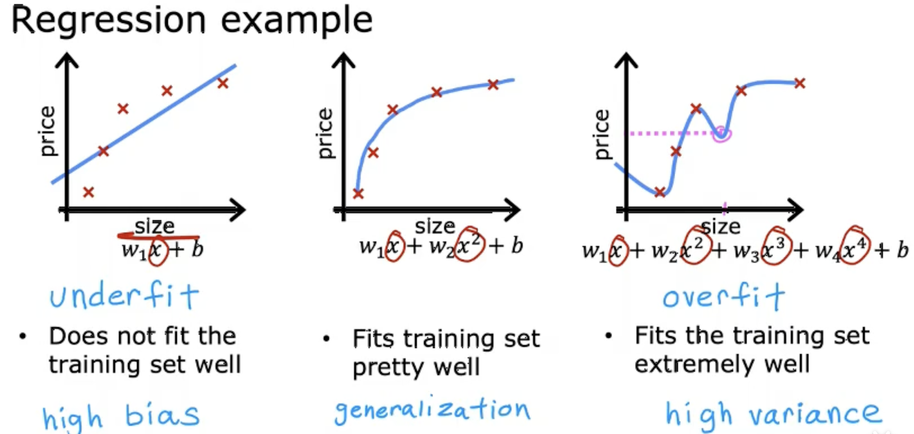
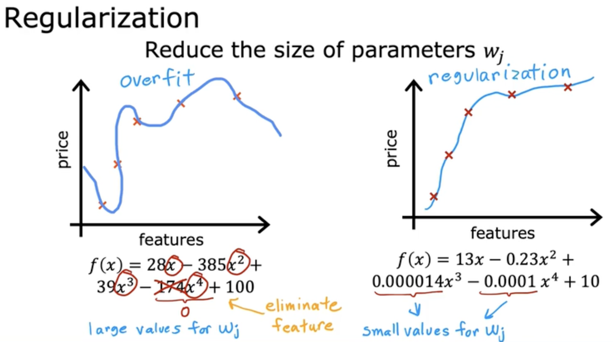

<head>
  
  
</head>

- [What is Machine Learning?](#what-is-machine-learning)
- [Supervised learning 监督学习](#supervised-learning-监督学习)
  - [Linear regression model 线性回归模型](#linear-regression-model-线性回归模型)
    - [Cost function 代价函数](#cost-function-代价函数)
    - [Gradient descent 梯度下降](#gradient-descent-梯度下降)
      - [Learning rate choise](#learning-rate-choise)
      - [Kinds of gradient descent](#kinds-of-gradient-descent)
  - [Multiple linear regression](#multiple-linear-regression)
    - [Vectorization](#vectorization)
    - [The gradient descent in multiple linear regression](#the-gradient-descent-in-multiple-linear-regression)
    - [Feature Scaling](#feature-scaling)
    - [Checking if gradient descent is convergent](#checking-if-gradient-descent-is-convergent)
    - [How to choose learning rate](#how-to-choose-learning-rate)
  - [Polynomial regression](#polynomial-regression)
  - [Logistic regression 逻辑回归](#logistic-regression-逻辑回归)
    - [The model of logistic regression 逻辑回归模型](#the-model-of-logistic-regression-逻辑回归模型)
    - [Decision boundary 决策边界](#decision-boundary-决策边界)
    - [Cost function of logistic regression 逻辑回归的代价函数](#cost-function-of-logistic-regression-逻辑回归的代价函数)
    - [Gradient descent implementation逻辑回归的梯度下降](#gradient-descent-implementation逻辑回归的梯度下降)
  - [Overfitting 过拟合](#overfitting-过拟合)
    - [Ways to reduce overfitting](#ways-to-reduce-overfitting)

# What is Machine Learning?

The machine learning has two kinds of algorithms. One is **supervised learning**, one is **unsupervised  learning**.

- **supervised learning**
  1. Make regression:It has an input x then give an output y(the right answers also called data sets).
  2. Make classification: predict categories, like give a diagnos of breast cancer(benign or malignant).

- **unsupervised learning**
  Data only comes with inputs x, but not outputs y. The algorithm has to find the some structure through the data. 

# Supervised learning 监督学习

## Linear regression model 线性回归模型

 

 Definitions:
 1. training set: the data we give to train the model
 2. x: inpute variable
 3. y: output variable
 4. m: number of training examples
 5. f(model): the function 
 6. $\widehat{y}$ :the predicted value
 7. linear regressing with one variable[univariate linear regression]: like the line in the picture

### Cost function 代价函数

Definitions:
1. error: equals to $\widehat{y}^i-y^i$
2. cost function: It is used to show how closely the function $f$ fits the real value. It equals to 
   
   $$J=\frac{1}{2m}\sum_{i=1}^m(\widehat{y}^i-y^i)^2$$

> We always defines the expression function of predicted value in linear regression like below.
> 
> $$\widehat{y} ^i= \sum_{i=0}^i \omega_ix_i+b$$

We can use contour plots to see the J curve directly like the picture below.

 

### Gradient descent 梯度下降

 

 This picture shows how gradient descent works to find the local minima. That is:
 1. choose a starting point
 2. look around to see the steep way to take the fasted step
 3. repeat the steps above

**The gradient descent algorithm**

We have to repeat these two algorithms until convergence.

$$w=w-\alpha\frac{\partial}{\partial w}J(w,b)$$

$$b=b-\alpha\frac{\partial}{\partial b}J(w,b)$$

 

Here $\alpha$ is **learning rate**. It's a value between 0 and 1. It controls how big step we will make each time.

About the partial derivative part. This is how it works if we assume b=0 and there is just one parameter w.

 

  

#### Learning rate choise

If $\alpha$ is too small, the gradient descent will be very slow. But if $\alpha$ is too big, it will never get to the minimum and it's fail to converge.

 

#### Kinds of gradient descent

1. Batch gradient descent 批量梯度下降 :
   Each step of gradient descent uses all the training samples.

## Multiple linear regression

 

$$f_{\bar{w},b}(\bar{x})=\bar{w}\cdot \bar{x}+b =w_1x_1+w_2x_2+\cdots+b$$

### Vectorization

We can short our code by victorization. We can use a tool called numpy. Here is the example.

    w = np.array([1,2,3,4])
    b = 4
    x = np.array([10,20,30,30])
    f = np.dot(w,x) + b

### The gradient descent in multiple linear regression

 

**Normal equation**: An alternative for gradient descent. It's for linear regression and may become slow if the n is too big. 

### Feature Scaling

Feature scaling is aimed at helping fasting the process of gradient descent. Because some ranges of features are too large and some are too small. We should normalize them.

 

We have three ways to normalize the features:
1. the regular one
    

2. mean normalization
    

$\mu$ here is the average value of the feature.

3. Z-score normalization

 

here standard deviation is 标准差

### Checking if gradient descent is convergent

We can draw this learning curve to check its convergence. The cost function should decrease after each iteration. If not, you should check your learning rate $\alpha$ to see if it's too big.

This method is not very depensible.

### How to choose learning rate

To check if there is a bug, we can use a very small learning rate to see if the cost function is decreasing. If not, there's a bug.

## Polynomial regression

It's like $y=w_0+w_1x+w_2x^2\cdots$ and in this case, feature scaling becomes more important.

## Logistic regression 逻辑回归

positive class: The set you want and need to output.

negative class: The set you don't want and no need to do output.

### The model of logistic regression 逻辑回归模型

$$f(\bar{x})=P(y=1|\bar{x};\bar{w},b)$$

Means under the input x, the model think the possibility is 1 and it's under the influence of w and b.

> 这张图实际展示：**z**是我们定义的表达式；**f**是我们的预测函数，其值为**g**函数，**f**最终只会输出0或1。

### Decision boundary 决策边界

The decision boundary is the curve when z=0. It can divide the positive and negative class.

> 在logistic function model下，当 $z>0$ 时，输出1；反之，输出0。所以决策边界可以通过令 $z=0$ 来求出。图中，有两个input variable。

### Cost function of logistic regression 逻辑回归的代价函数

**Why not use the cost function model of linear regression?**

> Because the linear regression's cost function is not **convex** in logistic regression and it will have many **local minimums**.

**The loss function:**

> 这里的**loss function**象征着线性回归中的**error**部分。当训练集为1时，$f(x)$ 越接近1误差越小；当训练集为0时，$f(x)$ 越接近0误差越小。

When $\widehat{y} = 1$ :

When $\widehat{y} = 0$ :

**The cost function:**

$$J = \frac{1}{m} \sum_{i=1}^m L(f(x^{i}),\widehat{y}^i)$$

**Simplified cost function:**

The two loss functions are the same actually:

Then the cost function will turn into:

$$J = \frac{1}{m}\sum_{i=1}^m -y^i \log f(x^i)-(1-y^i)\log(1-f(x^i))$$

### Gradient descent implementation逻辑回归的梯度下降

> **logisitc regression** 的 **gradient descent** 的表达式与 **linear regression** 相同。

## Overfitting 过拟合

> **underfitting** :展现出的是较大的偏差(bias)； **overfitting** :展现的是较大的方差(variance)，由于阶数过高，导致样本出现一点偏差都会导致出现不一样的拟合曲线。

### Ways to reduce overfitting

**1.Collect more training examples 收集更多训练样本**

**2.Select features to include 挑选合适的特征**

**2. Regularization to reduce overfitting 正则化以减小过拟合**

