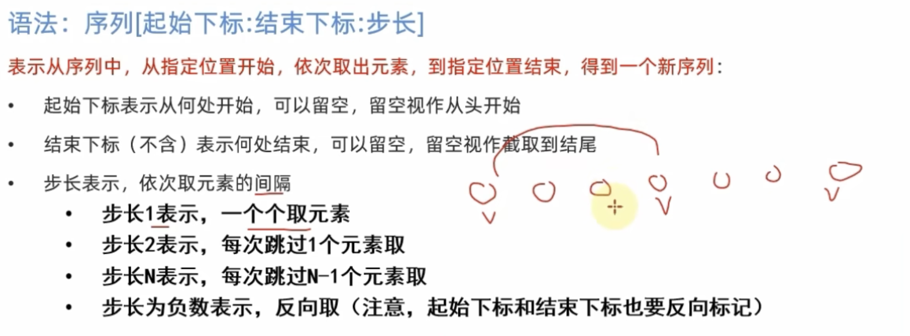

- [初级阶段学习](#初级阶段学习)
    - [数据类型](#数据类型)
    - [数据类型转换](#数据类型转换)
    - [标识符](#标识符)
    - [运算符](#运算符)
    - [字符串格式化与拼接](#字符串格式化与拼接)
    - [表达式的格式化](#表达式的格式化)
    - [数据输入](#数据输入)
    - [布尔类型和比较运算符](#布尔类型和比较运算符)
    - [逻辑判断语句](#逻辑判断语句)
    - [循环语句](#循环语句)
    - [函数](#函数)
    - [数据容器](#数据容器)
      - [列表](#列表)
      - [元组](#元组)
      - [字符串](#字符串)
      - [序列、切片](#序列切片)
      - [集合](#集合)
      - [字典](#字典)
      - [数据容器的操作](#数据容器的操作)
      - [字符串的比较](#字符串的比较)
    - [函数](#函数-1)
      - [多个返回值的接收](#多个返回值的接收)
      - [多种传参方式](#多种传参方式)
      - [函数作为参数传入](#函数作为参数传入)
      - [lambda匿名函数](#lambda匿名函数)
    - [文件](#文件)
      - [文件的编码](#文件的编码)

# 初级阶段学习

### 数据类型

名称|类型
---|---
string|字符串
int|整数
float|浮点数

> 可以直接使用Type来查看数据类型

        type(数据)

### 数据类型转换

语句|类型
---|---
int(x)|将x转换为整数
float(x)|将x转换为浮点数
str(x)|将x转换为字符串

> 并不是所有的字符串都能转换成数字

### 标识符

1. 标识符只能带有数字、字母、下划线，其中数字不能放在开头。
2. 标识符不能使用关键字

### 运算符

符号|输出
---|---
//|除取整
%|除取余
**|次方

复合赋值如：
   
        c+=a为c=c+a

### 字符串格式化与拼接

1. 可以直接使用+来拼接，注意仅能拼接字符串。
2. 使用%s将内容变为字符串类型放入(d整数类型,f浮点数类型)，%的组合来拼接，这种方法可以拼接字符串与数字

                name = 'Wangmusi'
                salary = 100000
                print(("His name is %s,his salary is %d") %(name,salary))

3. 快速的格式化采用以下方法
       
                name = 'Wang'
                deposit = 100
                print(f"He is {name}. He has {deposit}")
                He is Wang. He has 100

这个方法不限精度，不限数据类型。
> 常用m.n来控制精度，m表示数据宽度，n表示小数点后位数。如：

                print("%5.2f" %11.323)
                 11.32

### 表达式的格式化

表达式：一条具有明确运行结果的代码语句。
表达式可以直接用在格式化过程中，如以下括号内的就是表达式

                print(f"1*1 等于 {1*1}")
                1*1 等于 1

这种写法可以简化变量。

练习：

                company = 'Wang'
                stock_price = 10
                stock_price_daily_growth = 0.01
                days = 7
                price = stock_price*(stock_price_daily_growth+1)**days
                print(f"公司名称：{company}",f"公司目前股价 {stock_price}")
                print(("每日增长系数为：%.2f ;经过 %d 天后股价为 %.3f") %(stock_price_daily_growth,days,price))

                公司名称：Wang 公司目前股价 10
                每日增长系数为：0.01 ;经过 7 天后股价为 10.721  

### 数据输入
input 语句不管你输入的是什么都看作是字符串
> input（）括号内可以放入提示作用的字符串

                admin = input("你的银行账号是")
                admin = int(admin)
                num = input("余额为")
                num = float(num)
                print("你%d账号内的余额为%.2f" %(admin,num))
                你的银行账号是 123
                余额为 222
                你123账号内的余额为222.00

### 布尔类型和比较运算符

  

### 逻辑判断语句
1. if else 组合
        
        age = input("你的年龄")
        age = int(age)
        if age >= 18:
                print("你已经%d岁了，可以玩点花的了" %age)
        else:
                print("你还小，好好学习。")

        你的年龄 20
        你已经20岁了，可以玩点花的了

2. if elif else 组合

> 注意，判断语句之间是互斥的并且是按顺序执行的，满足一条语句后下面的语句就不会再执行

        age = int(input("输入答案"))

        if  int(input("输入你的答案")) == age:
                print("猜对了")
        elif int(input("再次输入你的答案")) == age:
                print("你终于猜对了")
        else:
                print("给你机会你也不中用啊！")

        输入答案 5
        输入你的答案 6
        再次输入你的答案 5
        你终于猜对了

### 循环语句

1. while循环
        
        i = 0
        while i<100:
                print("我爱你")
                i+=1

例题：

        import random
        num = random.randint(1,100)
        i = 1
        num_guess = int(input("输入猜的值"))
        while num_guess != num:
                if num_guess > num:
                        print("大了")
                else:
                        print("小了")
                num_guess = int(input("再次输入猜的值"))
                i += 1
        print(num_guess,i)

> end='':print(hello,end='')即可达到输出不换行，
> \t可替代空格对齐单词，如pring("hello\tworld")；\n可换行

2. for循环
   1. 该循环无法控制循环条件
        
                for 临时变量 in 待处理数据集
                        开始循环
        
   2. 可以通过range生成序列

                range(num) 从0开始
                range(num1,num2) 从num1开始不包含num2
                range(num1,num2,step) 从num1开始不包含num2,步长为step

   3. for 中的变量只能在 for 中使用，如果想要在for外调用，可以在for 前面先定义变量。

3. continue 和 break

continue : 结束本次循环，直接进行下次循环。且只能影响内层循环。

break : 直接结束循环。同样只对内层循环生效。

### 函数

1. 函数的定义

   1. 参数不需要可以省略
   2. 返回值不需要可以省略

   
                def 函数名(输入参数):
                        函数体
                        return 返回值

2. 函数返回值none类型
   
   1. 没定义返回值的，都会自动返回none，类型为type_none
   2. 在if语句中，none就等同于false

3. 作用域：函数体内的局部变量只会在函数体内生效，如果要在函数体内修改全局变量，则可以使用global关键字
        
        num = 100
        def test():
                global num
                num = 200
                num = 200

### 数据容器

数据容器：是一种可以存储多个元素的数据类型，共有列表(list)、元组(tuple)、字符串(str)、集合(set)、字典(dict)五种。

#### 列表

**定义方法**

        [1,2,3,4]
        a = [1,2,3,4]
        a = list()
        a = []

> 列表内可以存列表

**列表的下表索引取出元素**
下表从零开始，可以通过以下代码取出列表元素：

        name = [0,1,2,3,[0,1,2]]
        print(name[0])
        print(name[4][0])

**列表功能调用**

        列表.index(元素) #查下标
        列表[下标] = 值 #修改下标对应的值
        列表.insert(下标，插入的元素) #插入元素
        列表.append(元素) #追加元素至尾部
        列表.extend(其他数据容器) #将数据容器添加到列表尾部
        del 列表[下标] #删除元素
        列表.pop(下标) #将元素从列表中取出，可以返回值
        列表.remove(元素) #删除指定元素
        列表.clear() #清空列表
        列表.count(元素) #统计列表中同一元素的数量
        len(列表) #查看列表有多少元素

**列表的循环和遍历**

将列表中的内容依次取出，叫做遍历或迭代。

1. while

        index = 0
        while index < len(列表):
                element = 列表[index]
                print("元素内容为：{element}")
                index += 1
        
2. for 

        for index in 列表:
                print(f"元素内容为{index}")

#### 元组

元组同列表相似，但一旦完成封装就不可再篡改。但是如果元组内嵌套list，则可以修改list内的内容。

**元组的定义**

        x = (1,2,3,4)
        x = tuple()
        x = ()

> 当定义但无元素元组时，得在元素后加个逗号，否则不是元组类型。

**元组数据的取出**

        num = 元组[][]

**元组的调用**

仅有index，count，len三种。

        x = (1,2,[4,5,6])
        x[2].remove(6)
        print(x)

#### 字符串

字符串也是一种容器，且也是不可修改的容器。

        字符串.replace(字符串1，字符串2) #将字符串中的1替换为2，并得到一个新的字符串
        字符串.split(字符串) #将字符串按输入内容分割，并输出一个列表。
        字符串.strip() #不传入参数则默认去除首尾空格，传入参数则删除首尾符合的元素
 
#### 序列、切片

序列：内容连续，使用下标索引的数据容器，列表、元组、字符串都可以被视为序列。
切片：从序列里取出一个子序列。 

  

#### 集合

集合的性质：1. 不能重复 2. 输出无序 3. 可以修改

集合的定义：

        变量 = {1,2,3}
        变量 = set() #定义空集

集合的修改：

        set.add() #添加元素
        set.remove() #移除元素
        set.pop() #随机取出一个元素
        set.clear() #清空集合
        set1.difference(set2) #返回集合1和集合2的差集（集合1为主）
        set1.difference_update(set2) #在集合1中删除和集合2相同的元素
        set1.union(set2) #返回集合1和集合2的合并集合
        len() #统计长度

集合的遍历：

可以用for但不能用while循环，因为集合无序。

#### 字典

> 通过key去找到value

字典的性质：

字典和集合一样不允许重复，如果重复就会覆盖前面的值；没有下标序号，只能通过key查值；key不能嵌套字典，但是value可以嵌套字典。

字典的定义：

        字典 = {key:value,key:value}
        字典 = dict() #定义空字典      

字典的查找：

        dict[key] #通过key查找值

 例子：

        Wang_score = {"成绩":{"语文":100,"数学":100},"教育经历":{"中国":4,"法国":5}}
        Score1 = Wang_score["成绩"]["语文"]
        Year = Wang_score["教育经历"]["法国"]
        print(f"王的语文成绩{Score1}；王的法国教育经历{Year}")
        ## 王的语文成绩100；王的教育经历5

字典的操作：

        dict[key] = value #修改key对应值，如果不存在该key则新增
        dict.pop(key) #删除字典中对应的key和value
        dict.clear() #清空字典
        dict.keys() #返回全部key

字典的遍历：

        keys = dict.keys()
        for i in keys:
                print(f"key{i},value{dict[i]}")
        ### 另一种方法
        for i in dict:
                print(f"key{i},value{dict[i]}")

#### 数据容器的操作

        max/min(数据容器) #找最大/小元素值
        str/list/tuple/set(数据容器) #将数据容器类型转换
        sorted(容器,[reverse=false/true]) #false为正序，true为反序，结果为列表

#### 字符串的比较

字符串的比较是通过一位一位的比较，只要有一位大于另一个字符串，则该字符串大；每一位的大小可以查找ASKII码值来。

### 函数

#### 多个返回值的接收

        def a():
                return 1,2
        x,y = a()

#### 多种传参方式

一共有四种参数形式：位置参数、关键字参数、缺省参数和不定长参数。

1. 位置参数：根据函数定义的参数位置传递参数

        def a(1,2,3):
                return 0
        a(1,2,3)
2. 关键字参数：以key-value的形式传参

        def a(name,age,gender)
        a(age=21,gender='female',name='Wang')

3. 缺省参数：提前给个参数默认值，如果不传入，则按默认值处理

        def a(name,age,gender='male')

4. 不定长参数：有两种，分别是位置参数、关键词参数。

        def a(*args) #args是一个元组，储存参数，这里是位置参数
        def a(**kwargs) #这里储存关键词参数，这里的kwargs为字典

#### 函数作为参数传入

作用和意义：给被传入的函数一个计算逻辑

> 是一种逻辑的传入而不是以前参数的传入!!!

        def compute(a,b):
                return x+y
        def sum(compute):
                sum = compute(1,2)

#### lambda匿名函数

        lambda 参数:函数 #函数只能写一行，且不能重复使用

### 文件

#### 文件的编码

编码指如何将内容翻译成二进制并翻译回可识别内容。
