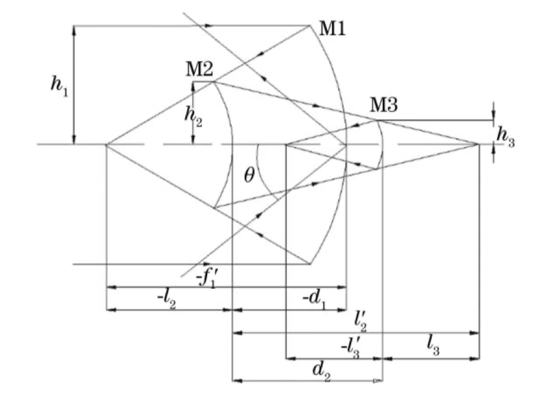

<head>
  
  
</head>

## 已知条件

$F^{\#}=\frac{f}{D}=5$

视场角：$1^{\degree}\times1^{\degree}$

入瞳直径：350mm

## 初始结构计算

1. 由F数，以及入瞳直径，可以得到系统焦距

$$f'=5\times 350=1750mm$$

2. 同轴系统中的遮拦比$\alpha$和各反射镜的放大率$\beta$计算

$$\begin{cases}
  \alpha _1=\frac{l_2}{f_1'}\approx \frac{h_2}{h_1}\\
  \alpha _2=\frac{l_3}{l_2'}\approx \frac{h_3}{h_2}\\
  \beta _1=\frac{l_2'}{l_2}\approx \frac{u_2}{u_2'}\\
  \beta _2=\frac{l_3'}{l_3}\approx \frac{u_3}{u_3'}
\end{cases}$$

